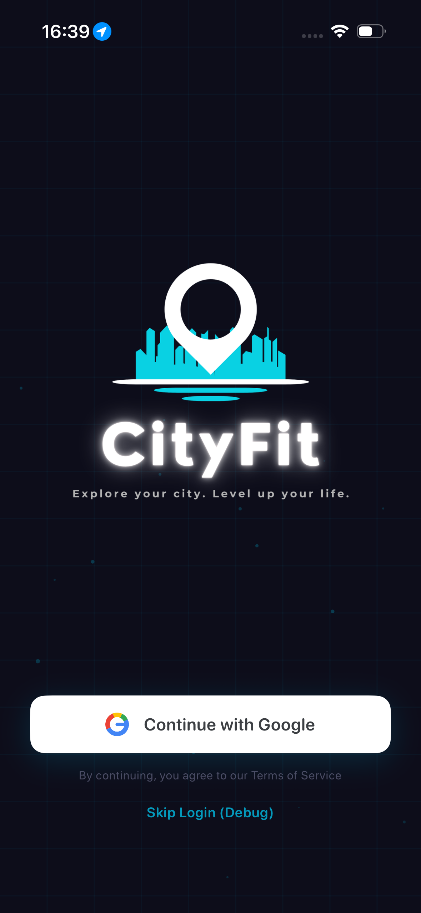
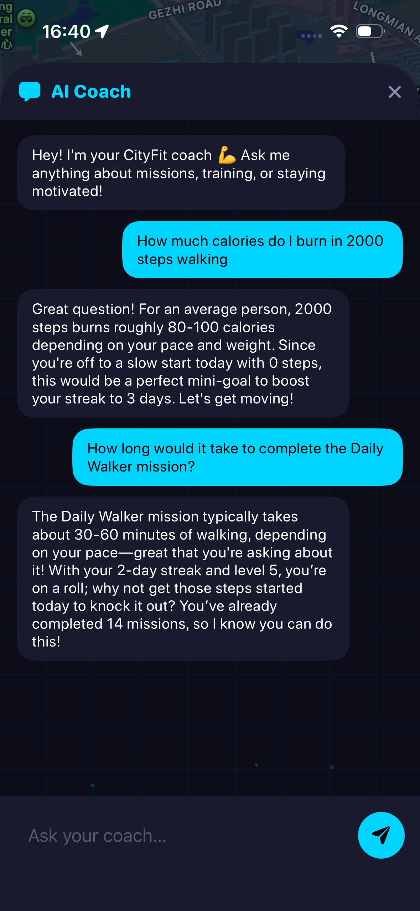
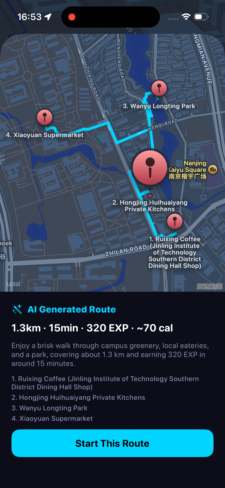
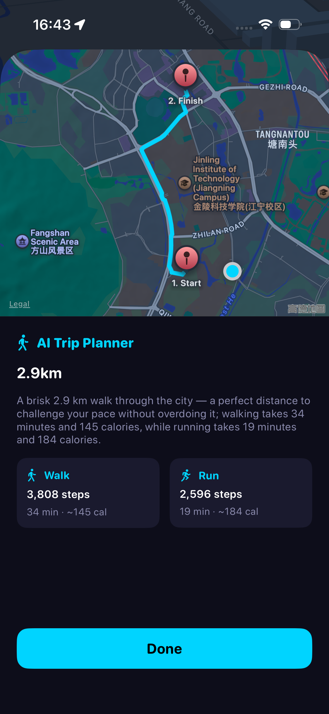
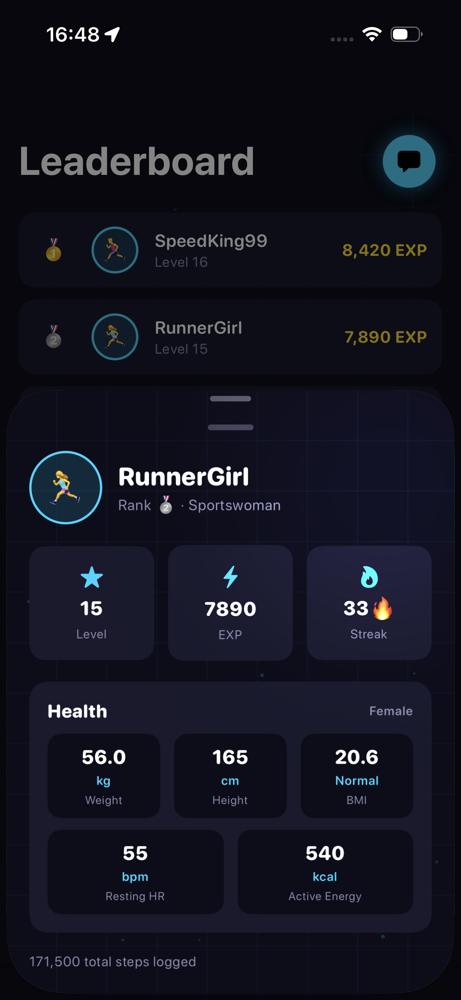
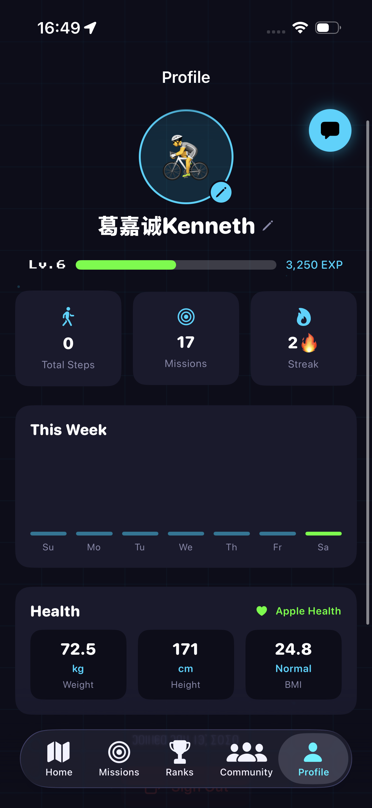

<div align="center">

# 🏃 CityFit

### *Explore your city. Level up your life.*

**A gamified, AI-powered fitness app that turns everyday walking and running into a game.**

[](https://swift.org)
[](https://developer.apple.com/xcode/swiftui/)
[](https://www.apple.com/ios/)
[](https://developer.apple.com/xcode/)
[](https://flask.palletsprojects.com/)
[](https://www.crewai.com/)
[](https://www.deepseek.com/)
[](https://firebase.google.com/)

</div>

---

## 📑 Table of Contents

- [What is CityFit?](#-what-is-cityfit)
- [Why I Built It](#-why-i-built-it)
- [Features](#-features)
- [AI & Machine Learning](#-ai--machine-learning)
- [Screenshots](#-screenshots)
- [Tech Stack](#-tech-stack)
- [Architecture](#-architecture)
- [Run It Yourself](#-run-it-yourself)
- [Project Structure](#-project-structure)
- [Documentation](#-documentation)

---

## 🌆 What is CityFit?

Most fitness apps just show you numbers — steps, calories, distance. The numbers are correct, but they're boring, so people stop opening the app after a week or two.

**CityFit fixes that by turning exercise into a game.** You walk and run around your real city to complete missions, earn EXP, level up a character, and climb leaderboards. On top of the game, an AI layer plans routes for you, judges how hard a trip will be, coaches you through chat, and verifies photo missions with computer vision.

It's built as two independent halves:

- **📱 iOS app** — SwiftUI, MVVM, real GPS + step tracking, on-device photo detection. Runs fully offline with mock data.
- **🤖 AI backend** — Python + Flask + CrewAI, calling DeepSeek. Powers the chat coach, route generator, trip planner, and the backup photo-verification layer.

---

## 💡 Why I Built It

I'm from Indonesia, and physical inactivity there is a real, measurable problem — not just a personal one. Motorbike culture, hot weather, and broken or missing sidewalks mean walking is rarely part of daily life. Based on the Indonesian Health Survey (2023), **37.4% of Indonesians aged 10+ don't get enough physical activity**, and WHO data shows the trend getting worse, not better.

People *know* they should move more. The problem is motivation, not knowledge. So instead of fighting screen addiction, CityFit borrows the same reward loop that keeps people hooked on games — levels, missions, streaks — and points it at physical movement instead.

---

## ✨ Features

| Feature | What it does | Powered by |
|---|---|---|
| 🗺️ **Live GPS Map** | Real-time map with your location, mission pins, and a 3D-style building view | MapKit + CoreLocation |
| 👟 **Step & Distance Tracking** | Counts steps and distance during active missions | CoreMotion (CMPedometer) |
| 🎯 **Missions & EXP** | Walk/run and photo missions that award EXP and level up your character | Swift + Firestore |
| 📸 **Photo Missions** | Find and photograph real objects (cat, bicycle, chair…) to complete missions | On-device Vision + trained CoreML model |
| 🏃 **Activity Detection** | Detects walking / running / stationary to apply an EXP multiplier | On-device motion heuristic |
| 💬 **AI Coach Chat** | A chat coach that knows your level, streak, and daily progress | CrewAI + DeepSeek |
| 🧭 **AI Route Generator** | Builds a walking route through nearby missions and landmarks | CrewAI + MapKit MKDirections |
| 📍 **AI Trip Planner** | Pick two points, get real walking distance + walk/run pace estimates | MapKit + CrewAI |
| 🏆 **Leaderboard** | Real-time ranking across users | Firebase Firestore |
| 👥 **Communities & Chat** | Join communities and chat in real time | Firebase Firestore |
| ❤️ **Apple Health** | Optional sync of health data for more accurate stats | HealthKit |
| 🔐 **Google Sign-In** | Real login via Google account | Firebase Auth |

---

## 🧠 AI & Machine Learning

CityFit uses **4 CrewAI crews / 6 agents** in the backend, plus an **on-device trained CoreML model**.

### Multi-agent backend (CrewAI + DeepSeek)

| Endpoint | Crew | Agents | Triggered by |
|---|---|---|---|
| `/chat` | **Chat Crew** | Personal Coach | Opening the AI chat coach |
| `/route` | **Route Crew** | Route Planner → Fitness Calculator | Tapping "Generate Route" |
| `/plan-trip` | **Trip Crew** | Distance Analyst → Pace Estimator | Tapping "Plan Trip" + picking 2 points |
| `/verify-photo` | **Vision Crew** | Object Detection Specialist | "Snap" (only when on-device confidence is too low) |

The two-agent crews show real **agent collaboration** — the first agent's output is passed into the second as context (`context=[previous_task]`), and the whole crew retries once if the output comes back malformed.

### On-device photo detection (trained CoreML)

Photo missions run **on the phone first** using a custom model trained in **CreateML**:

- **9 classes** — bicycle, bottle, car, cat, chair, computer, person, plants, trashbin
- **14,470 labeled images** — **85.6%** training accuracy / **84.6%** validation accuracy
- Auto-completes the mission at high confidence, fully offline

If on-device confidence lands in the uncertain middle band, the user can tap **Snap** to send the photo to the backend **Vision Crew** for a stronger check — with an on-device re-check as a fallback if the backend is unreachable.

> 🛡️ **Every AI feature degrades gracefully.** If the backend is offline, the app keeps working — it just shows an "AI unavailable" message instead of crashing.

---

## 📸 Screenshots

> Replace the placeholders below with real PNGs (e.g. add them under `docs/screenshots/`).

<div align="center">

| Login | Home Map | AI Chat Coach |
|:---:|:---:|:---:|
|  |  |  |
| **AI Generated Route** | **AI Trip Planner** | **Photo Mission** |
|  |  |  |
| **Missions** | **Leaderboard** | **Profile** |
|  |  |  |

</div>

---

## 🛠️ Tech Stack

**iOS App**
- **Language / UI:** Swift 5, SwiftUI (MVVM, strictly)
- **Maps & Location:** MapKit (iOS 16 API), CoreLocation
- **Sensors:** CoreMotion (steps + activity), HealthKit
- **Camera & Vision:** AVFoundation, Vision framework, CoreML (trained `ImageClassifier.mlmodel`)
- **Backend & Cloud:** URLSession, Firebase Auth, Firebase Firestore, Google Sign-In

**AI Backend**
- **Server:** Python + Flask
- **Multi-agent:** CrewAI (4 crews / 6 agents)
- **LLM:** DeepSeek (`deepseek-v4-flash`, text + vision, OpenAI-compatible API)
- **Tunnel:** Ngrok (exposes the local server to the phone)

**Build Environment**
- macOS Ventura 13.6 · Xcode 14.3.1 · iOS 16 SDK · Deployment target iOS 16.0

---

## 🏗️ Architecture

CityFit is split into two systems that work independently:

```
┌─────────────────────────────────┐         ┌──────────────────────────────┐
│        iOS App (SwiftUI)         │         │      Firebase Backend        │
│                                  │  Auth   │  ┌────────────┐ ┌──────────┐ │
│  Views → ViewModels → Services   │◄───────►│  │ Auth       │ │ Firestore│ │
│                                  │ Firestore│ │ (login)    │ │ (chat,   │ │
│  On-device: GPS, steps, camera,  │         │  └────────────┘ │  ranks)  │ │
│  photo detection (CoreML)        │         │                 └──────────┘ │
└───────────────┬──────────────────┘         └──────────────────────────────┘
                │ HTTPS via Ngrok
                ▼
┌──────────────────────────────────────────────────────┐
│         AI Backend — Flask + CrewAI (DeepSeek)        │
│                                                        │
│  /chat        → Chat Crew   (Personal Coach)          │
│  /route       → Route Crew  (Planner → Calculator)    │
│  /plan-trip   → Trip Crew   (Analyst → Estimator)     │
│  /verify-photo→ Vision Crew (Object Detection)         │
└──────────────────────────────────────────────────────┘
```

- **Instant / offline work** (steps, GPS, live photo detection) stays **on the phone**.
- **Reasoning / natural language** (coaching, judging difficulty, planning) goes to the **AI backend**.

---

## 🚀 Run It Yourself

CityFit's two halves run independently. The iOS app works on its own with mock data; the backend is only needed for the AI features.

### 1. iOS app (Simulator)

> Requires **macOS**, **Xcode 14.3.1**, **iOS 16 SDK**. Don't let Xcode auto-upgrade the Swift packages.

```bash
open "CityFit iOS Project.xcodeproj"
```

Then hit ▶ with an iOS 16 Simulator selected. To simulate movement:
**Simulator → Features → Location → City Run** (steps auto-mock on the Simulator).

This is enough to explore almost the whole app — missions, map, leaderboard, community, profile — all on local mock data, no backend required.

### 2. AI backend (for chat / route / trip / Snap verification)

```bash
cd cityfit_backend
python -m venv venv
venv\Scripts\activate            # Windows  (source venv/bin/activate on macOS/Linux)
pip install -r requirements.txt
copy .env.example .env           # add your DeepSeek API key inside

# Terminal 1
python app.py
# Terminal 2 — exposes localhost so the phone can reach it
ngrok http 5000
```

Copy the `https://…ngrok-free.app` URL Ngrok prints into
[`CityFit iOS Project/Utils/Constants.swift`](CityFit%20iOS%20Project/Utils/Constants.swift) as `backendURL`
(the free tier issues a new URL every restart), then rebuild the app.

📖 **Full setup, troubleshooting, and physical-device signing:** [`docs/HOW_TO_RUN.md`](docs/HOW_TO_RUN.md)

---

## 📁 Project Structure

```
cityfit-ios-project-app/
├── CityFit iOS Project/        # iOS app (SwiftUI, MVVM)
│   ├── Models/                 # Mission, User, CommunityMessage…
│   ├── ViewModels/             # MissionViewModel, AIViewModel, CameraViewModel…
│   ├── Views/                  # Auth, Onboarding, Main, Components
│   ├── Services/               # Location, Pedometer, Vision, Firestore, AIService…
│   ├── Utils/                  # Constants, MockData, EXPCalculator
│   └── ImageClassifier.mlmodel # Trained CoreML photo classifier
│
├── cityfit_backend/            # AI backend (Flask + CrewAI + DeepSeek)
│   ├── app.py                  # 4 endpoints
│   └── crews/                  # chat / route / trip / vision crews
│
├── docs/                       # Detailed documentation (see below)
└── CLAUDE.md                   # Engineering / build constraints
```

---

## 📚 Documentation

| Doc | What's inside |
|---|---|
| [`docs/HOW_TO_RUN.md`](docs/HOW_TO_RUN.md) | Full setup & run guide (Firebase, backend, Xcode, troubleshooting) |
| [`docs/AI_AND_ML.md`](docs/AI_AND_ML.md) | AI/ML deep dive: backend LLM, on-device vision, CreateML training |
| [`docs/DESIGN_SPEC.md`](docs/DESIGN_SPEC.md) | Every screen, tab, component, and the visual system |
| [`docs/PROJECT_STATUS.md`](docs/PROJECT_STATUS.md) | What's done, what's not, next steps |
| [`docs/PROJECT_BACKGROUND.md`](docs/PROJECT_BACKGROUND.md) | The original product spec/concept |
| [`cityfit_backend/README.md`](cityfit_backend/README.md) | Backend endpoints + curl test examples |

---

<div align="center">

**Built with SwiftUI, CrewAI, and a lot of walking.** 🚶💨

</div>
